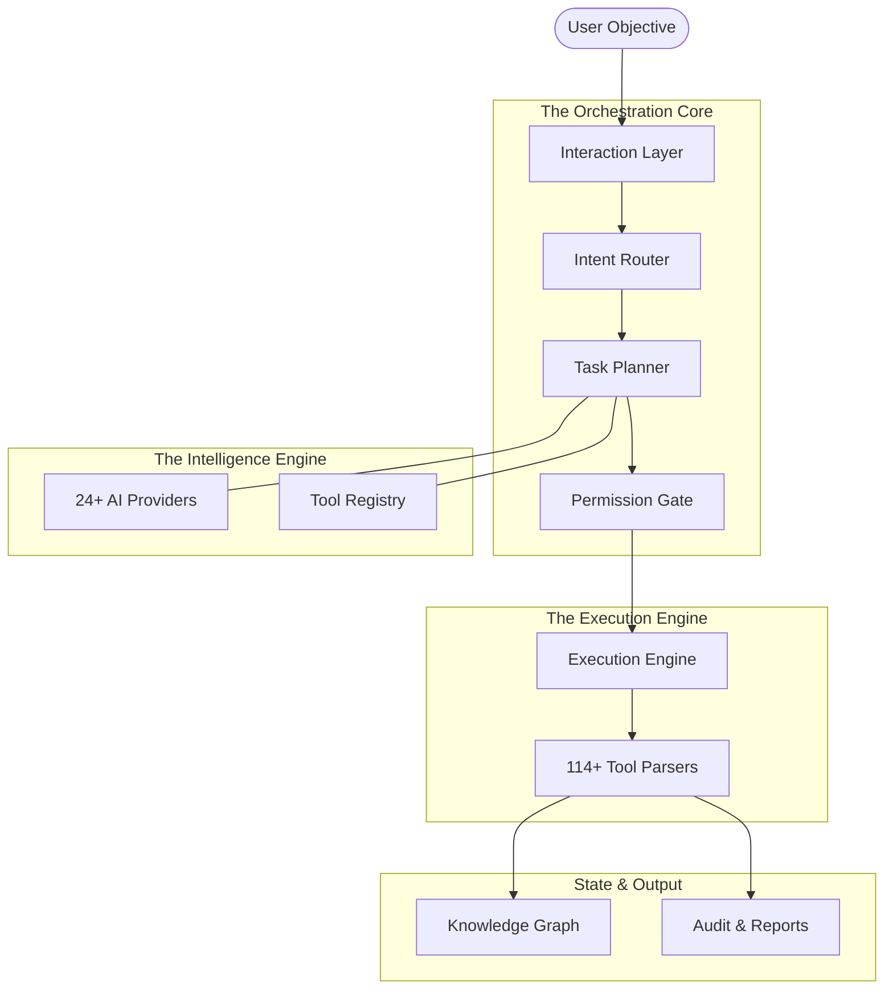

# 🏗️ System Overview

Welcome to the architectural heart of Siyarix. Siyarix is a high-performance, AI-native cybersecurity operations platform designed to bridge the gap between human intuition and deterministic tool execution. 

Think of it as an intelligent orchestration layer that sits on top of your existing security toolkit, transforming natural language objectives into precise, safely-executed workflows.

---

## 🗺️ High-Level Architecture

The Siyarix architecture is designed for modularity, safety, and provider independence. Here is how a request flows through the system:

---

## 💎 Core Design Principles

Our architecture is guided by six foundational pillars:

1.  **💻 CLI-First**: We believe the terminal is the natural home for security operators. All functionality is accessible without any GUI dependencies.
2.  **🧠 AI-Native**: Intelligence is not an afterthought. AI planning is our default path, with a graceful, heuristic-based fallback always ready.
3.  **🔌 Provider-Agnostic**: Siyarix doesn't care which "brain" you use. We support 24+ provider profiles, ranging from global cloud APIs to local, privacy-first models.
4.  **📡 Offline-Capable**: Security often happens in isolated environments. Siyarix works perfectly in air-gapped networks using local inference (Ollama, llama.cpp) and heuristic planning.
5.  **🛡️ Safety-Gated**: Every single command passes through a multi-stage permission gate (Syntax -> Danger Analysis -> User Approval) before touching your system.
6.  **🧱 Extensible**: From tool parsers and AI providers to personas and workflows—everything in Siyarix is a pluggable module.

---

## 🧩 Key Subsystems

| Subsystem | What it Does |
|-----------|--------------|
| **Interaction Layer** | Manages how you talk to Siyarix, whether through a direct CLI command, the interactive Chat REPL, or a headless API. |
| **Intent Router** | The "traffic controller." It analyzes your input using a 4-stage pipeline (Exact -> Regex -> Keyword -> LLM) to decide where it should go. |
| **AI Provider Layer** | A robust abstraction that manages connectivity, failover, and circuit breaking across 24+ AI backends. |
| **Task Planners** | The brains behind the operation. They decompose your high-level goals into a sequence of safe, actionable tool executions. |
| **Execution Engine** | The workhorse. It runs tools in parallel, manages dependencies, and recovers from errors in real-time. |
| **Tool Registry & Parsers** | Our "encyclopedia." It knows about 562+ tools and features 114+ specialized parsers to make sense of their outputs. |
| **Security & Audit** | The guardians. Manages the encrypted credential vault, permission gates, and a tamper-evident, cryptographically chained audit trail. |

---

## 📈 Scalability & Performance

Siyarix is built to handle intensive security operations without breaking a sweat:

-   **Worker Pool**: A bounded `asyncio` pool ensures we never overwhelm your system resources during parallel scans.
-   **Smart Caching**: An LRU cache with TTL handles everything from tool outputs to AI provider responses, making repeated tasks near-instant.
-   **Knowledge Graph**: An in-memory entity relationship model keeps track of discovered hosts, ports, and vulnerabilities, enabling the AI to "learn" about your environment in real-time.
-   **Enterprise Ready**: Includes a multi-stage Dockerfile, REST API with JWT auth, and OpenTelemetry-powered observability.

---

*For a deeper dive into any of these components, explore the specific guides in the `architecture/` directory.*
